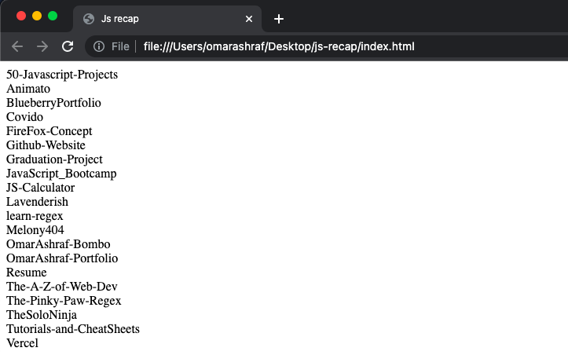

# ➖➖➖➖➖➖🔴 AJAX 🔴➖➖➖➖➖➖

> AJAX >> Asynchronous Javascript And XML

> AJAX is Not a Programming Langauage, It is a Technique Which Contains Many Technologies.

> AJAX allows web pages to be updated asynchronously by exchanging small amounts of data with the server behind the scenes. This means that it is possible to update parts of a web page, without reloading the whole page.

## Deal With Network Requests

You Can See Webpage Request As Follows...

1. Righ Click
1. Inspect Element
1. Choose Network Tab
1. Refresh Page

**Now You Can See all Network Requets.**

## Status Codes

1. Informational responses (100–199)
1. Successful responses (200–299)
1. Redirection messages (300–399)
1. Client error responses (400–499)
1. Server error responses (500–599)

## Most Comman Status Codes

1. `404` >> Not Found >> The server can not find the requested resource.

1. `500` >> Internal Server Error >> The server has encountered a situation it does not know how to handle.

1. `200` >> Ok >> The request succeeded.

1. `429` >> Too Many Requests >> The user has sent too many requests in a given amount of time

Click [Here](https://developer.mozilla.org/en-US/docs/Web/HTTP/Status) To Check All Status Codes.

## Create XHR Request

> let myRequest = new XMLHttpRequest();

> myRequest.open("Method","URL","Async ?", "user", "password")

- `Method` >> GET, POST, DELETE & PUT
- `URL` >> Api Link or Local File.
- `Async` >> True or False >> Asyncronous or Synchronous ?
  - true is Default Value >> Asynchronous >> Will Not Stop Functions Till The Request is Ended.
  - false >> Synchronous >> Will Stop all the next Functions Till The Request is Ended.
- `UserName` if Authentication Needed.
- `Password` if Authentication Needed.

> myRequest.send()

```javascript
// Create new XHR Request
let myRequest = new XMLHttpRequest();

// Open The Request With Get Method and Pass The API URL
myRequest.open(
  "GET",
  "https://api.github.com/users/omarashraf-bombo/repos",
  true
);

// Send The Request to Server
myRequest.send();

// When ready state Value Change
myRequest.onreadystatechange = function () {
  // If EveryThing is Ok
  if (myRequest.readyState === 4 && myRequest.status === 200) {
    // Convert The JSON to Javascript Object
    let theDataObject = JSON.parse(myRequest.responseText);

    // Loop on The Data and add Repo Names in DOM
    for (let i = 0; i < theDataObject.length; i++) {
      let div = document.createElement("div");
      let repoName = document.createTextNode(theDataObject[i].name);

      div.appendChild(repoName);
      document.body.appendChild(div);
    }
  }
};
```

**Output in Body is**


